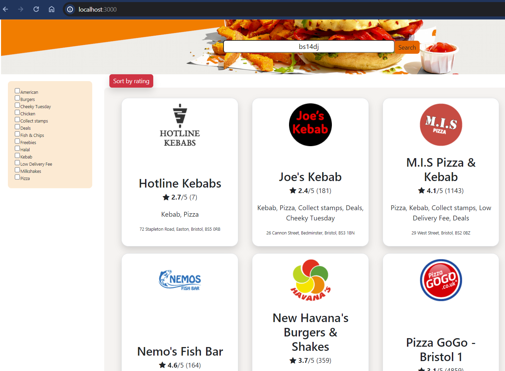

# JustEat Restaurant Finder

## Table of Contents
- [Overview](#overview)
- [Features](#features)
- [How to Build, Compile, and Run the Solution](#how-to-build-compile-and-run-the-solution)
- [Assumptions and Clarifications](#assumptions-and-clarifications)
- [Possible Improvements](#possible-improvements)
- [References](#references)

## Overview
This project is a web application for finding restaurants using the JustEat API. The JustEat Restaurant Finder allows users to search for restaurants by postcode and view detailed information about each restaurant, including its name, cuisines, rating, and address. **As per the instructions of the JET team, the application limits the display to the first 10 results.**

## Features
- Search for restaurants by postcode
- View detailed information about each restaurant such as name, rating, cuisine type, and address.
- Filter search results by cuisine type
- Sort the results by name or rating

## How to Build, Compile, and Run the Solution
1. Clone the repository to your local machine.
2. Navigate to the project directory.
3. Install dependencies by running `npm install`.
4. Start the development server by running `npm start`.
5. Access the application in your web browser at `http://localhost:3000`.
6. Open another terminal, navigate to the `server` folder of this project, and run the backend server file `node server.js` to resolve the CORS policy error.

## Assumptions and Clarifications
- Initially, I encountered CORS issues when trying to request data from the JustEat API. I received error messages such as `"XMLHttpRequest at 'https://uk.api.just-eat.io/discovery/uk/restaurants/enriched/bypostcode/EC4M7RF' from origin 'http://localhost:3000' has been blocked by CORS policy: No 'Access-Control-Allow-Origin' header is present on the requested resource."` To resolve this, I set up a proxy server using Express.js on `localhost:5000`.
- Some words returned from the cuisine names, such as 'Collect stamps', 'Low Delivery Fee', etc., may not fit the conventional definition of cuisines. I reached out to the team for clarification and was informed that these are used on the official website and app but are optional for the assignment.
- This project is built with React.js, so it typically doesn't require manual compilation of code during development. Tools like Babel and webpack are used behind the scenes to automatically compile JSX and ES6 code into browser-compatible JavaScript that can be run in the browser.

## Possible Improvements
- Implement more advanced filtering or sorting options such by name then filter by rating, possible sort by distance base on the postcode.
- Enhance the user interface with additional features like interactive maps.
- Improve error handling and user feedback for invalid inputs or API failures.
- Add hover effects to change the color or make text bold for better user interaction.
- Incorporate animated food GIF images for a more visually appealing effect.

## References
- I found the CORS policy solution from this [YouTube video](https://www.youtube.com/watch?v=PNtFSVU-YTI&list=PLEJukB5b5cE9L1Nw5D2VQrLVDY7uEeaht&index=54). It was really helpful for me to understand the concept, and I highly recommend it.
- This is also a good tutorial [Youtube video](https://youtu.be/phWxA89Dy94?si=znwDHiIqM24-TM7H) for building CSS with Bootstrap.
- I referenced the user interface with my previous project [Lunchmates](https://www.lunchmates.club/) that's also a food platform especially designed for social meetup.
